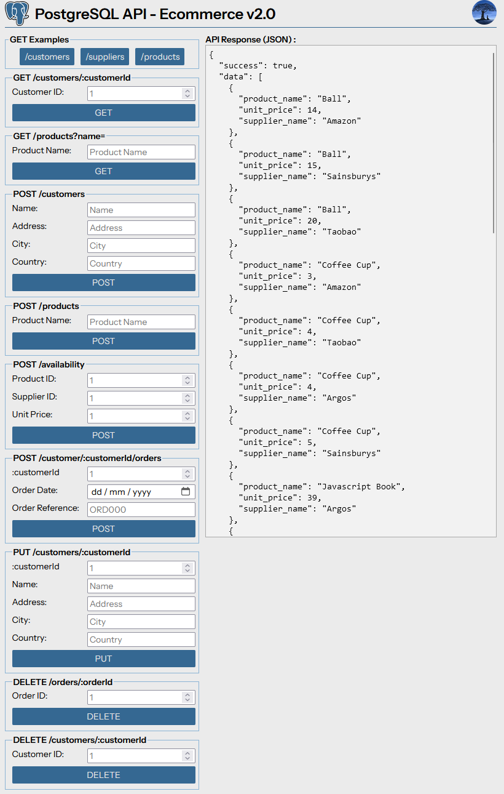

# PostgreSQL Ecommerce API v2.0

## Description

Written from scratch Frontend with HTML, CSS, Vanilla JS  
Showcasing the Backend Node Express API and its functionality  
That is interacting with a PostgreSQL Database

## Screenshot:



## Instructions:

1. clone this repo
2. install [postgresql](https://www.postgresql.org/)
3. inside the root of the repository, open a terminal:
4. move into the `2-api/cyf-ecommerce-api/` folder:
   `cd 2-api/cyf-ecommerce-api/`
5. create the database  
   `createdb cyf_ecommerce`
6. populate the database  
   `createdb -d cyf_ecommerce -f cyf_ecommerce.sql`
7. install the project dependencies:  
   `npm install`
8. create your own `.env` file in the `/cyf-hotels-api/` directory and add your PostgreSQL details (refer to the `.env.example` file) :

```
DB_HOST=
DB_PORT=
DB_NAME=
DB_USER=
DB_PASS=
```

9. start the server in develoment mode:  
   `npm run dev`
10. visit http://localhost:3000
